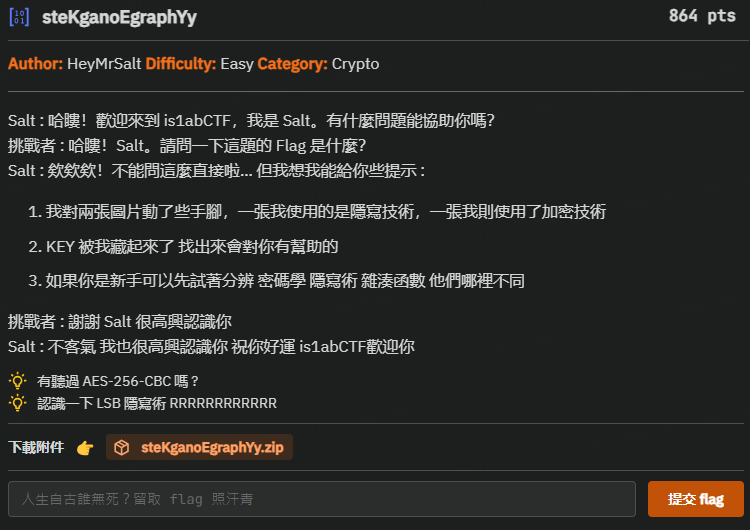

## 🔑 steKganoEgraphYy (1000 pts) 

═════════════════════════════════\
**Author:** HeyMrSalt **Difficulty:** Easy **Category:** Crypto\
═════════════════════════════════\
\
Salt : 哈瞜！歡迎來到 is1abCTF，我是 Salt。有什麼問題能協助你嗎？\
挑戰者 : 哈瞜！Salt。請問一下這題的 Flag 是什麼？\
Salt : 欸欸欸！不能問這麼直接啦… 但我想我能給你些提示 :

1. 我對兩張圖片動了些手腳，一張我使用的是隱寫技術，一張我則使用了加密技術
2. KEY 被我藏起來了 找出來會對你有幫助的
3. 如果你是新手可以先試著分辨 密碼學 隱寫術 雜湊函數 他們哪裡不同

挑戰者 : 謝謝 Salt 很高興認識你\
Salt : 不客氣 我也很高興認識你 祝你好運 is1abCTF歡迎你\
\
Hints :\
💡 1.有聽過 AES-256-CBC 嗎 ?\
💡 2.認識一下 LSB 隱寫術 RRRRRRRRRRRR\
\
**下載附件** 👉 [steKganoEgraphYy.zip](https://github.com/HeyMrSalt/is1abCTF-2024-Challenges/raw/main/crypto/steKganoEgraphYy/steKganoEgraphYy.zip)

---

# Pic-Challenge-Message

